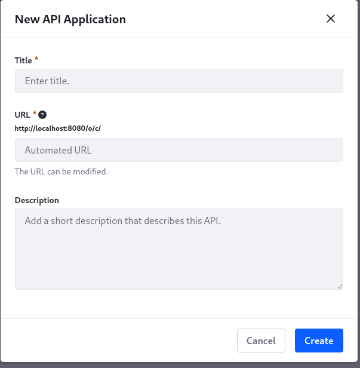
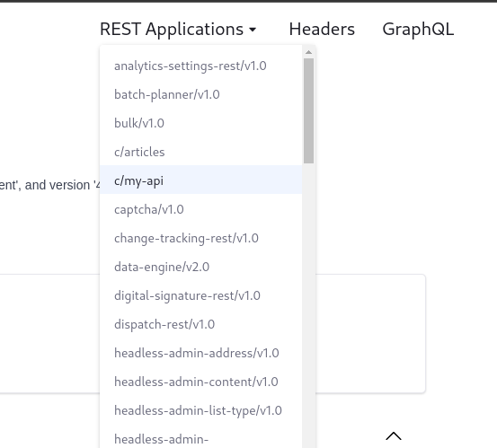
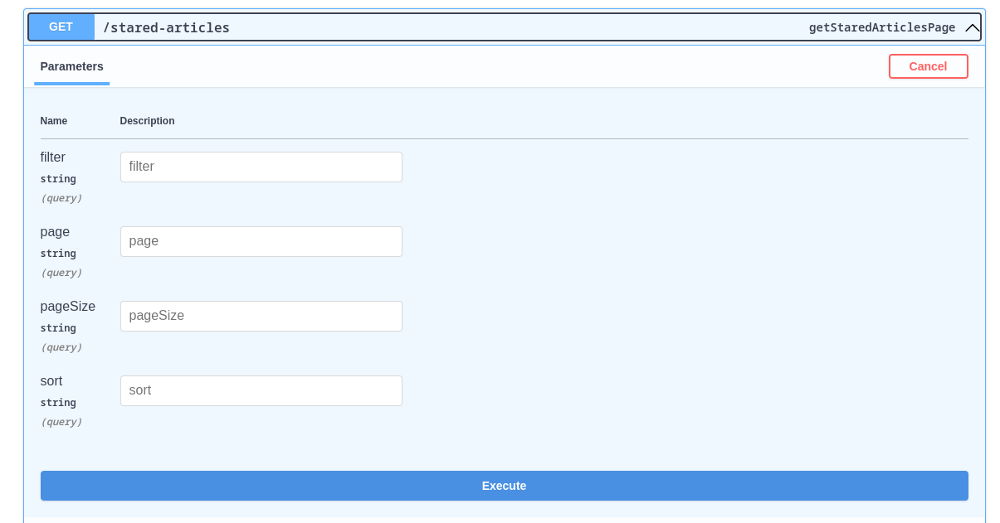

[API builder](https://learn.liferay.com/w/dxp/headless-delivery/api-builder) é atualmente uma beta feature pela qual administradores podem customizar APIs de Objects, tanto System  Objects quanto novos Objects.


O escopo do que pode ser customizado, neste momento, ainda é pequeno. 

### Atualmente o API Builder permite customizar em um endpoint, dentro deste escopo:
- Omitir campos do response body original
- Alterar o nome de campos do response body original
- Aplicar filtros no endpoint original
- Aplicar ordenação no endpoint original
- Expor o novo endpoint customizado pelo método GET ou POST
 
### Não está no escopo atual do API Builder
- Transformar dados do endpoint original, ex: operações em texto, aritmética, lógica, etc
- Fazer outras chamadas HTTP que não seja o endpoint original

### Feature Flag
Para começar, é necessário ativar a feature flag API Builder.

`Control Panel > Instance Settings > Feature Flags > Beta > API Builder (LPS-178642)`


Após salvar e atualizar a página, ficará disponível no menu a nova opção API Builder


 

### Criar um novo API
O primeiro passo é criar uma API onde poderão ser disponibilizados diversos endpoints, podendo estes endpoints customizar diferentes Objects.


 


 

Neste caso a minha API será acessada pela URL /c/my-api. E os endpoints da minha API estão dentro dessa URL, como vamos ver a seguir. 

Na URL da API não aceitas novas barras, nem pontos, ou nenhum outro caractere especial além do traço.

Não é possível atualmente criar uma URL para a API como por exemplo: /my-api/v1.0/
 
### Criar um novo schema dentro do novo API
O próximo passo é criar um schema a ser usado por um ou mais endpoints da minha API


No meu caso vou criar um Schema baseado em um Object que criei e chamei de Article. Nesse object além dos campos default criei os campos AuthorName (text), Title (text), Stared (true or false)


Como descrito no nome do meu custom schema estou criando um response simplificado omitindo todos os campos default e mostrando apenas os campos Title e AuthorName que criei no meu Object Article.

Também estou mudando o nome AuthorName apenas para Author

Esse campo Author não é o campo Author default do response original, é o campo AuthorName com o nome mudado para Author


Criar um novo endpoint dentro do novo API
Finalmente podemos criar os endpoints que irão utilizar os schemas da API



 
 


Nesse caso criei dois endpoints customizados

*/articles* irá listar todos os meus Articles mas com o response body simplificado omitindo a maioria dos campos

*/stared-articles* usar o mesmo schema que omite campos e adicionalmente aplicará um filtro implícito para retornar apenas articles com o campo stared igual à true.


### Endpoint /articles

 


 

### Endpoint /stared-articles

 


### Testando a nova API
A nova API já está disponível para uso e também está disponível a sua documentação OpenAPI na página Liferay API Explorer da sua instância Liferay. Por exemplo, se estiver usando o liferay em localhost:8080 pode encontrar a Liferay API Explorer ao acessar: http://localhost:8080/o/api

No menu REST Applications, encontre a sua API criada pelo API Builder, no nosso caso a que tem a URL /c/my-api

O prefixo /c na URL da API customizada não é opcional e nem editável
 


### Testando o endpoint /articles


Ao executar esse endpoint o retorno será todos os articles somente com os campos configurados no schema customizado. Por exemplo


```
{
  "actions": {},
  "facets": [],
  "items": [
    {
      "Author": "M. Tanuri",
      "Title": "Hello World"
    },
    {
      "Author": "M. Tanuri",
      "Title": "Trying API Builder!"
    }
  ],
  "lastPage": 1,
  "page": 1,
  "pageSize": 20,
  "totalCount": 2
}
```

### Testando o endpoint /stared-articles
 


Ao executar esse endpoint o retorno será apenas os articles com o valor do campo stared igual à true e somente com os campos configurados no schema customizado serão apresentados. Por exemplo:


```
{
  "actions": {},
  "facets": [],
  "items": [
    {
      "Author": "M. Tanuri",
      "Title": "Trying API Builder!"
    }
  ],
  "lastPage": 1,
  "page": 1,
  "pageSize": 20,
  "totalCount": 1
}
```
   
Neste momento nossa aplicação está pronta para ser utilizada, entretanto somente usuários autenticados no Liferay terão permissão de acessá-la. No próximo blog revelaremos mais detalhes dessa beta feature, e como configurar acesso público a seus endpoints.